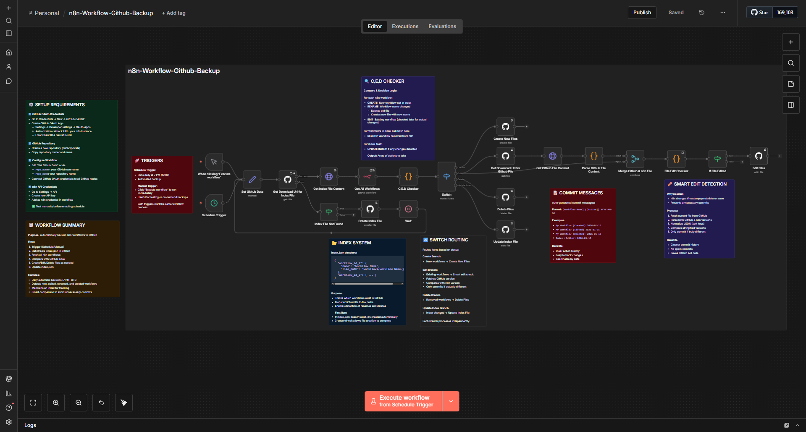

# n8n Workflow Github Backup

> An automated **n8n workflow** that backs up all your n8n workflows to GitHub with intelligent change detection, creating a version-controlled backup system that syncs automatically.


This workflow automatically detects new, edited, renamed, and deleted workflows in your n8n instance, then syncs them to a GitHub repository with smart commit messages and an index tracking system.



---

## How It Works

1. **Trigger**: The workflow runs automatically every day at 7 PM UTC (or manually when triggered).
2. **Get/Create Index**: Attempts to fetch `index.json` from your GitHub repository.
   * **If found** → Downloads and parses it.
   * **If not found** → Creates a new empty index file and waits 3 seconds for GitHub to process.
3. **Fetch All Workflows**: Retrieves all workflows from your n8n instance via the n8n API.
4. **Smart Comparison**: The "C,E,D Checker" (Create, Edit, Delete) analyzes differences:
   * **CREATE** → New workflow not in index.
   * **RENAME** → Workflow name changed (deletes old file, creates new one).
   * **EDIT** → Existing workflow (flagged for content comparison).
   * **DELETE** → Workflow removed from n8n but still in GitHub.
   * **INDEX UPDATE** → Triggered if any changes detected.
5. **Route Actions**: Switch node routes each action to the appropriate branch:
   * **Create Branch** → Creates new workflow files in GitHub.
   * **Edit Branch** → Performs smart edit detection:
     * Fetches current file from GitHub.
     * Compares GitHub version vs. n8n version (normalized JSON).
     * **Only commits if content actually changed** (avoids timestamp-only updates).
   * **Delete Branch** → Removes workflow files from GitHub.
   * **Update Index Branch** → Updates `index.json` with latest mappings.
6. **Commit Messages**: Auto-generated with format: `[Workflow Name] (Action) YYYY-MM-DD`

---

## Requirements

* **GitHub OAuth2 Credentials**:
  * Go to [GitHub Developer Settings](https://github.com/settings/developers) → OAuth Apps → New OAuth App.
  * Set **Authorization callback URL** to your n8n instance URL (e.g., `https://your-n8n.com/rest/oauth2-credential/callback`).
  * Copy **Client ID** and **Client Secret**.
  * Add as OAuth2 credential in n8n (*Credentials → New → GitHub OAuth2*).

* **GitHub Repository**:
  * Create a new repository (public or private).
  * Note your **username** (repo owner) and **repository name**.

* **n8n API Credentials**:
  * In your n8n instance → *Settings → API* → Create new API key.
  * Add as n8n API credential in the workflow.

---

## How to Use

1. **Import the Workflow**:
   * Copy the provided JSON file.
   * In your n8n instance → click **Import Workflow** → paste or upload the JSON.

2. **Create GitHub Repository**:
   * Go to GitHub → Create a new repository (e.g., `n8n-workflows-backup`).
   * Leave it empty (no README, no .gitignore).

3. **Set Up GitHub OAuth2**:
   * In n8n → *Credentials → New → GitHub OAuth2*.
   * Fill in:
     * **Client ID** → from GitHub OAuth App.
     * **Client Secret** → from GitHub OAuth App.
   * Click **Connect my account** and authorize.

4. **Set Up n8n API Credentials**:
   * In n8n → *Settings → API* → Create new API key.
   * Copy the key.
   * In workflow → *Credentials → New → n8n API* → paste the key.
   * Set **Base URL** to your n8n instance (e.g., `https://your-n8n.com`).

5. **Configure Repository Details**:
   * Find the **"Set Github Data"** node in the workflow.
   * Edit the assignments:
     * `repo_owner`: Replace `"your-github-username"` with your GitHub username.
     * `repo_name`: Replace `"your-github-repository-name"` with your repository name.

6. **Connect Credentials to Nodes**:
   * Open each **GitHub node** (there are 6 total):
     * Create Index File
     * Get Download Url for Index File
     * Create New Files
     * Update Index File
     * Get Download Url for Github File
     * Delete Files
     * Edit Files
   * Set **Credential for GitHub OAuth2** to the one you created.
   * Open the **"Get All Workflows"** node → Set **Credential for n8n API** to the one you created.

7. **Test the Workflow**:
   * Click the **"When clicking 'Execute workflow'"** manual trigger node.
   * Click **"Test workflow"**.
   * Monitor execution → All nodes should turn green.
   * Check your GitHub repository → Should see `index.json` and `workflows/` folder.

8. **Activate for Auto Mode**:
   * Once tested successfully, toggle the workflow to **Active**.
   * It will now run automatically every day at 7 PM UTC.

---

## Notes

* **Smart Edit Detection**:
  * The workflow uses normalized JSON comparison to avoid unnecessary commits.
  * n8n often changes internal timestamps/metadata when workflows are opened but not modified.
  * Only commits when actual workflow logic/configuration changes.

* **Index System**:
  * `index.json` maps workflow IDs to file paths and names:
    ```json
    {
      "workflow_id_abc123": {
        "name": "My Workflow",
        "file_path": "workflows/My Workflow.json"
      }
    }
    ```
  * Enables detection of renames and deletions.
  * Updates automatically when changes occur.

* **File Structure in GitHub**:
  ```
  your-repo/
  ├── index.json
  └── workflows/
      ├── Workflow Name 1.json
      ├── Workflow Name 2.json
      └── Workflow Name 3.json
  ```

* **Rename Handling**:
  * When a workflow is renamed, the old file is deleted and a new file is created.
  * Two commits will appear: one for deletion, one for creation.

* **Commit Message Format**:
  * Created: `Workflow Name (Created) 2026-01-15`
  * Edited: `Workflow Name (Edited) 2026-01-15`
  * Deleted: `Workflow Name (Deleted) 2026-01-15`
  * Index: `Index (Edited) 2026-01-15`

* **Pinned Data**:
  * The workflow automatically excludes pinned data from backups (set in "Get All Workflows" node).

* **Error Handling**:
  * If index.json doesn't exist on first run, it's created automatically.
  * All GitHub nodes have "Retry on Fail" enabled.
  * Continue on error is enabled for index file lookup.

---

## Example Behavior

* **Day 1 (First Run)**:
  * Workflow triggers at 7 PM → No index.json found → Creates index.json.
  * Fetches 5 workflows from n8n → All marked as "CREATE".
  * Commits 6 files: `index.json` + 5 workflow files.

* **Day 2**:
  * You create 1 new workflow, edit 1 existing workflow, rename 1 workflow.
  * Workflow triggers at 7 PM → Detects changes:
    * 1 CREATE (new workflow).
    * 1 DELETE + 1 CREATE (rename).
    * 1 EDIT → Compares content → Different → Commits.
    * INDEX UPDATE.
  * Commits: 5 total (1 create, 1 delete, 1 create, 1 edit, 1 index update).

* **Day 3**:
  * You open a workflow but don't change anything (n8n updates internal timestamp).
  * Workflow triggers at 7 PM → Detects 1 EDIT candidate.
  * Fetches GitHub version → Compares normalized JSON → **Identical**.
  * **No commit made** (smart detection prevents spam).
  * Only INDEX is checked → Unchanged → **Workflow completes with 0 commits**.

* **Day 4**:
  * You delete 2 workflows from n8n.
  * Workflow triggers at 7 PM → Detects 2 DELETE + INDEX UPDATE.
  * Commits: 3 total (2 deletions, 1 index update).

---

## Customization

* **Change Schedule**:
  * Edit the **"Schedule Trigger"** node → modify `triggerAtHour` (currently `19` for 7 PM UTC).
  * Can also change to run weekly, monthly, etc.

* **Change File Path**:
  * Modify `filePath` in GitHub nodes to store workflows in a different location (e.g., `backups/{{ $json.name }}.json`).

* **Add Repository Description**:
  * You can add a step to create/update a README.md in your GitHub repo with backup metadata.

* **Notification on Changes**:
  * Add an "Send Email" node at the end to notify you when backups complete.
  * Connect after the final GitHub nodes with a summary of changes.

* **Multiple Repositories**:
  * Duplicate the workflow and change `repo_name` in "Set Github Data" to backup to different repos.

---

**Author:** Muhammad Anas Farooq
